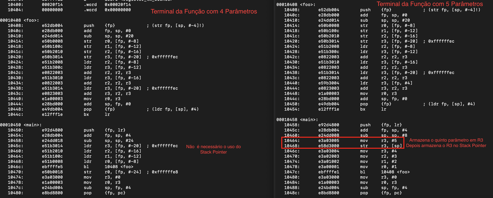

# Buffer Overflow ARM Processor



The main goal of this project is 

## Requirements

To build this lab you will need ...

## Running locally

After cloning this repository, you can type the following command to start the application:

```sh
command
```

## Attack narrative

To reproduce this Buffer Overflow you must follow this path:

#### Step 1

#### Step 2

#### Step 3

#### Step 4

## References

For further documentation...

* [Reference1][Reference1] 
* [Reference2][Reference2] 

## Contributing

If you find any issues or want to contribute send a Pull Request, please! 🚀

[Reference1]: https://github.com/nandohdc/INF1823
[Reference2]: https://github.com/nandohdc/INF1823